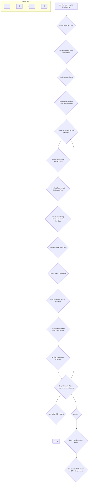

# [Toastmasters International](https://www.toastmasters.org/education/pathways) according to bard.google.com

Explanation:

1. Join a Club: The process starts with joining a Toastmasters club and completing the membership process.
1. Induction & Guide: You'll be inducted into the club and receive the Pathways guide.
1. Self-Assessment: Take the online Self-Assessment Test to choose your learning path within Pathways.
1. Log in to Base Camp: Access the online learning platform, Base Camp, using your Toastmasters credentials.
1. Self-Assessment (Before): Complete the initial "Assess Your Skills" section for your chosen project.
1. Choose Project: Select your first project from Level 1 of your chosen path.
1. Project Launch: Work through the project launch screens on Base Camp for instructions and resources.
1. Download Resources: Download any necessary resources and the evaluation form for your speech.
1. Prepare Speech: Prepare your speech based on the project requirements (e.g., Icebreaker speech for new members).
1. Schedule Speech: Schedule your speech delivery with the Vice President of Education (VPE).
1. Deliver Speech: Deliver your speech at a club meeting.
1. Evaluation Form: After your speech, provide the evaluation form to your assigned evaluator.
1. Self-Assessment (After): Complete the "Assess Your Skills - After" section reflecting on your speech delivery.
1. Review Feedback: Access your ePortfolio to review the feedback provided by your evaluator.
1. Next Project: Congratulations! You're ready to move on to the next project within Level 1. Repeat steps 6-14 for remaining projects.
1. Level Progression: Once you complete all projects in Level 1, move on to Level 2, Project 1, and repeat steps 6-14 for each subsequent level (2-5).
1. Path Completion: Upon finishing all projects within your chosen path, you'll earn a Path Completion Badge.
1. Next Steps: Choose a new path or work on Distinguished Toastmasters (DTM) requirements to further your Toastmasters journey.

